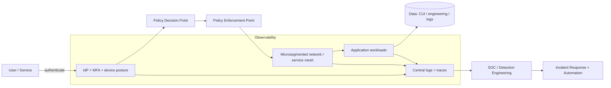
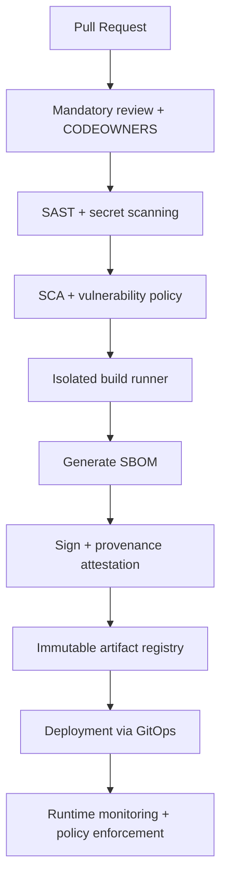

# Staff-Level Cybersecurity Hardening for Defense Contractors and AegisRange Repository Upgrade

## Executive summary

Defense contractors (including primes and major subcontractors like BAE Systems and Raytheon) sit in a uniquely hostile threat environment where **espionage, pre-positioning, and supply chain compromise** are often more strategically valuable to adversaries than short-term disruption. The U.S. government’s own cleared-industry threat reporting highlights a shift toward **human-centric collection tactics** (not just purely technical intrusions), including approaches routed through email and recruiting-style workflows, which aligns with broader identity-led intrusion trends documented across major incident-response and threat reports. citeturn3search15turn3search3turn15search0turn15search1

A staff-level hardened posture that survives nation-state and APT targeting is best achieved as a **system of mutually reinforcing controls**, not as a list of tools. The strongest practical pattern is:

1. **Identity as the control plane** for every access decision (human and machine), combined with **Zero Trust Architecture** principles. citeturn2search0turn2search1turn2search2  
2. **Hard segmentation and microsegmentation** to prevent credential compromise or edge-device exploitation from turning into unrestricted lateral movement. citeturn2search0turn6search0turn6search8  
3. **Software supply chain rigor** (SSDF + SBOM + provenance) because defense ecosystems routinely depend on deep vendor and OSS dependency graphs. citeturn2search15turn5search0turn14search1turn5search7  
4. **Detection and response engineered for speed**, grounded in modern incident handling guidance, plus continuous monitoring and exploit-driven patch prioritization. citeturn5search17turn5search10turn6search2  
5. **Compliance-as-evidence**: mapping operational controls to the contract and regulatory environment (CUI handling, DFARS incident reporting, CMMC certification pathways, ITAR export controls, and any applicable FedRAMP/DoD cloud requirements). citeturn0search6turn4search29turn0search9turn11search5turn8search16  

Repository audit headline (your attached AegisRange repo, inspected locally): the project is a **frontend + backend web system** with baseline controls (JWT auth, role checks, a simple rate limiter, and CI lint/test). It is not currently engineered for **high-assurance identity, distributed-rate-limiting, production-grade secrets management, security headers, supply chain attestation, or defense-grade logging/monitoring integration**. The result is a meaningful gap between “works securely enough for a demo” and “approaches a cleared/regulated environment’s expectations.”

This report therefore delivers two outputs:

- A CTO-grade, defense-oriented **threat and control model** (with mappings to NIST/DoD-aligned frameworks and a risk matrix).
- A concrete, **prioritized remediation roadmap** and repo-specific code/pipeline upgrades you can implement as the backbone of your “massive action-plan upgrade.”

## Threat landscape for defense contractors

### Adversary classes and what they optimize for

**Nation-state and APT operators** optimize for access longevity, stealth, and mission impact: theft of technical data, targeting of programs and supply chains, and pre-positioning for future conflict escalation. Major public threat intelligence reporting continues to highlight identity compromise, exploitation of externally facing infrastructure, and targeted campaigns against defense and technology verticals. citeturn15search0turn15search1turn4search3

**Cybercriminal groups** frequently converge on defense contractors via ransomware or extortion, because (a) downtime is expensive, (b) sensitive data has leverage value, and (c) the supply chain creates many “weak-link” entry points. Broader breach analysis shows persistent dominance of credential compromise, social engineering, and third-party involvement in intrusions. citeturn15search4turn15search0

**Insider threats and human-enabled collection** are elevated in cleared industry. DCSA’s reporting explicitly highlights **resume submissions and job-solicitation vectors** as common collection methods and emphasizes email as a frequent vector, which is consistent with modern spearphishing and “trusted relationship” exploitation models. citeturn3search15turn3search3

**Supply chain threats** span software (dependency tampering, CI/CD compromise), hardware/firmware (bootkits, implantable persistence), and services (MSSPs, IT contractors, cloud providers). U.S. government supply-chain policy and guidance has increasingly formalized requirements around secure development, verification, and transparency mechanisms such as SBOMs. citeturn14search17turn14search0turn14search1turn5search0

### Dominant tactics, techniques, and procedures in this sector

A defense-contractor baseline TTP set typically aligns well with the entity["organization","MITRE","nonprofit r&d corp us"] ATT&CK enterprise model (credential theft, initial access via edge devices, lateral movement, data staging and exfiltration, and impact). ATT&CK is explicitly intended to categorize real-world adversary behaviors and supports detection coverage mapping. citeturn6search1turn6search5

The most practically important (and cost-effective) defensive implication is that **most catastrophic outcomes are “second-order effects.”** The initial compromise is rarely the true failure; the true failure is that the compromise can move laterally, escalate privilege, access crown jewels, and exfiltrate without being contained quickly.

### Threat-to-mitigation risk matrix

The table below provides a CTO-grade risk matrix that maps common cleared-industry threats to mitigation stacks. “Primary mitigations” are the controls that materially change the outcome, not merely add visibility.

| Threat | Likely initial access / TTP pattern | Impact | Detection signals | Primary mitigations (stack) | Evidence alignment |
|---|---|---|---|---|---|
| APT credential compromise | Phishing, token theft, infostealers, OAuth abuse, password spraying | Silent access to CUI/tech data, persistent foothold | IdP anomalies, impossible travel, atypical token scopes, unusual admin consent | Zero Trust identity controls, phishing-resistant MFA, conditional access, PAM/JIT, device posture enforcement | NIST ZTA; DoD ZT strategy; identity guidance in NIST digital identity standards citeturn2search0turn2search1turn12search1 |
| Edge device exploitation | VPN/routers/virtualization layer exploits; stealth backdoors | Full network pivot, high stealth | Unusual management-plane traffic, config changes, new services, outbound C2 from infra | Hardened edge, rapid KEV-driven patching, isolate management plane, microsegmentation, netflow visibility | CISA KEV; threat intel reporting of network-device targeting citeturn6search2turn4search3 |
| Supply chain CI/CD compromise | CI runner compromise, stolen signing keys, dependency substitution | Trojan releases, mass compromise downstream | Build provenance mismatch, unexpected dependency graph, unsigned artifacts | SSDF, SLSA provenance + verification, SBOM generation, artifact signing, protected build environments | NIST SSDF; SLSA provenance; EO 14028 SBOM drivers citeturn2search15turn5search7turn14search17turn14search1 |
| Insider theft | Privileged user exfil, contractor abuse, data hoarding | Direct loss of CUI/ITAR data, sabotage | Large downloads, atypical repo access, unusual removable media behavior | Least privilege, DLP + classification, strong logging, UEBA, segmented access to crown jewels | Cleared-industry human-focused threats highlighted by DCSA citeturn3search15turn3search3 |
| Ransomware with exfiltration | Stolen credentials, RDP/VPN access, lateral movement to backups | Operational shutdown, contractual breach risk | Spike in auth failures, mass file rename/encrypt, backup deletions | EDR with containment, immutable backups, segmentation, privileged access controls, incident-ready playbooks | Modern threat reporting emphasizes ransomware’s operational impact; incident response guidance citeturn15search0turn5search17 |
| Cloud misconfiguration / over-privilege | Public storage exposure, excessive IAM, exposed secrets | Data leaks, privilege escalation | CSP audit logs, policy changes, public access detection | CSPM, least-privilege IAM, centralized logging, secrets management, workload isolation | Cloud provider security guidance; cloud identity best practices citeturn7search2turn7search3turn8search3 |
| Firmware/boot persistence | Secure Boot misconfig, malicious firmware updates | Near-undetectable persistence, multi-rebuild survivability | Secure Boot state drift, firmware integrity failures | Secure Boot governance, firmware resiliency, measured boot and attestation | NIST firmware resiliency + NSA Secure Boot guidance citeturn13search0turn13search3turn13search7 |

## Recent high-profile incidents and observed TTPs

### Cleared-industry targeting patterns

The entity["organization","Defense Counterintelligence and Security Agency","us cleared industry agency"] annual “Targeting U.S. Technologies” reporting and the agency’s public summaries emphasize that adversaries increasingly blend technical and human approaches; one cited pattern is heavy use of recruiting workflows (resume submission) as a collection mechanism and email as a common vector for those approaches. citeturn3search15turn3search3

This matters operationally because it shifts some of the highest-ROI defensive effort toward:

- Identity governance and access lifecycle controls (especially contractor onboarding/offboarding).
- Mail and collaboration hardening (phishing-resistant auth, attachment detonation, strict DMARC/SPF/DKIM, and “safe links” style controls).
- Insider-threat monitoring that is grounded in role-based risk, not blanket surveillance.

### Defense-adjacent espionage campaigns targeting infrastructure layers

entity["company","Google Cloud","cloud platform"] threat intelligence reporting on UNC3886 describes a China-nexus espionage actor with a history of targeting **network devices and virtualization technologies**, using high-end tradecraft (including exploitation of vulnerabilities and custom malware) and focusing on sectors including defense and technology. citeturn4search3turn4search27

The core defensive point is that “standard endpoint security” is insufficient if the attacker’s persistence sits:

- On routers/switches and other network devices.
- Inside virtualization layers (hypervisors, management planes).
- In identity providers and cloud control planes.

### Example of compliance failure translating into enforcement risk

The entity["organization","U.S. Department of Justice","us federal justice dept"] announced a $9M settlement with entity["company","Aerojet Rocketdyne","us aerospace defense supplier"] related to allegations of misrepresenting compliance with cybersecurity requirements in federal contracts, demonstrating that government contractors can face material enforcement exposure tied to cybersecurity representations and controls. citeturn3search1turn3search13

For a defense CTO, the lesson is direct: **security controls are not only technical risk controls, they are contractual and legal risk controls**. Security governance must explicitly include assurance that statements made in proposals, SSPs, and customer attestations are supported by evidence.

### Example of breach claims and the challenge of verification

Public reporting in March 2026 described claims of a large data theft targeting entity["company","Lockheed Martin","us aerospace defense prime"] (allegations attributed to a pro-Iran actor). This remains a case where external reporting may precede confirmed public detail, reinforcing the need for breach-credibility triage and pre-planned communications and verification workflows. citeturn3search2turn3search6

## Compliance and regulatory frameworks

### Baseline: what frameworks actually do in a defense context

A defense contractor typically must treat compliance as layered:

- **Risk framework** (management system): NIST CSF 2.0, ISO 27001.
- **Control catalog & baselines**: NIST 800-53 + 800-53B.
- **CUI safeguarding**: NIST 800-171 (baseline) plus NIST 800-172 (enhanced requirements for HVAs/critical programs).
- **DoD acquisition enforcement**: CMMC (certification regime) and DFARS clauses for safeguarding and reporting.
- **Export controls and dissemination rules**: ITAR (and related export-controlled CUI categories).

The key operational point is that these standards are highly interrelated: NIST 800-53 is a broad catalog; 800-171 is a tailored requirement set heavily used for CUI; 800-172 adds enhanced requirements for higher-value targets; CMMC is DoD’s mechanism to enforce and validate implementation across the Defense Industrial Base. citeturn1search9turn1search1turn10search0turn0search9turn4search29

### Comparison table: frameworks, scope, assurance model

| Standard / regime | What it is | Primary scope for a contractor | Assurance method | Notes for CTO implementation |
|---|---|---|---|---|
| entity["organization","National Institute of Standards and Technology","us standards agency"] CSF 2.0 | Risk management framework organized into functions (including a new “Govern” function) | Cyber risk governance, communication, prioritization | Not a certification by itself | Best used as the “executive dashboard” to coordinate program outcomes and metrics. citeturn1search2turn1search8turn11search25 |
| NIST SP 800-53 Rev. 5 | Security/privacy control catalog | Broad controls for federal systems and widely adopted elsewhere | Assessed via control assessment procedures | Use as a superset control catalog; tailor via overlays. citeturn1search9turn1search21 |
| NIST SP 800-53B | Control baselines (low/moderate/high) | Baseline selection and tailoring | Baseline-driven, evidence oriented | Relevant for FedRAMP and high-assurance internal systems. citeturn10search2turn10search6 |
| NIST SP 800-171 Rev. 2 | Security requirements for protecting CUI in nonfederal systems | CUI handling enclaves and boundaries | Assessed; often via SSP + POA&M + scoring | Core floor for DoD contractors handling CUI/CDI. citeturn1search1turn1search3 |
| NIST SP 800-172 | Enhanced security requirements for CUI tied to HVAs / critical programs | High-value CUI systems needing APT resilience | Assessed via 800-172A | Treat as “advanced overlay” for crown jewels rather than applying everywhere. citeturn10search0turn10search1 |
| entity["organization","Cybersecurity Maturity Model Certification","dod contractor certification"] (CMMC) | DoD certification model aligned to CUI/FCI requirements | Defense contracting eligibility | Certification / assessment rules in regulation | Rulemaking outcomes and enforcement dates matter for roadmap. citeturn4search29turn0search5turn0search9 |
| DFARS 252.204-7012 | Contract clause: safeguarding + cyber incident reporting | Covered Defense Information (CDI) and incident reporting | Contractual compliance; reporting required | Includes incident reporting time expectations. citeturn0search6 |
| entity["organization","International Organization for Standardization","global standards body"] ISO/IEC 27001:2022 | ISMS standard for managing security | Enterprise ISMS and certification needs | Third-party certification possible | Useful for global customers and structured governance, but must be mapped to DoD-specific requirements. citeturn11search18turn11search11 |
| ITAR (22 CFR 120-130) | Export control regime for defense articles/services and technical data | Export-controlled technical data access and dissemination | Regulatory compliance; audits/enforcement | Cyber controls must support access restrictions, segregation, and controlled sharing. citeturn11search5turn11search10 |

### CUI and boundary design: an explicit architectural requirement

The CUI program is standardized by entity["organization","National Archives and Records Administration","us national archives"], and the CUI Registry defines categories including export-controlled information. This matters because **your “CUI boundary” is the first-order architectural object** in CMMC/NIST 800-171 practice: where CUI exists, what systems touch it, and how it is isolated. citeturn10search7turn10search3turn10search11

## Secure architecture patterns for a hardened defense CTO

### Zero Trust as the controlling design philosophy

A Zero Trust Architecture is defined in NIST SP 800-207 as a shift away from perimeter trust toward continuous evaluation of users, assets, and resources, using policy enforcement and decision points. citeturn2search0turn2search16 The DoD has formalized Zero Trust strategy and execution expectations, including portfolio governance and milestones, reinforcing that this is a multi-year program, not a product purchase. citeturn2search1turn2search10

The CISA Zero Trust Maturity Model (v2.0) provides a structured maturity path across pillars and capabilities and is directly usable as a practical “what to build next” map. citeturn2search2turn2search5

image_group{"layout":"carousel","aspect_ratio":"16:9","query":["NIST zero trust architecture diagram policy engine policy enforcement point","DoD zero trust pillars diagram data identity device network application","microsegmentation network segmentation architecture diagram"],"num_per_query":1}

### Reference architecture: identity-centric, segmented, observable

A defensible target state for a defense contractor usually converges on:

- **Identity provider** as the control plane: phishing-resistant MFA, conditional access, device compliance, and privileged identity workflows.
- **Microsegmented network**: strict separation between corporate IT, engineering, OT, CUI enclaves, CI/CD, and production workloads.
- **Workload identity and service-to-service authorization**: ideally enforced via service mesh patterns for microservices, with mTLS and consistent policy. NIST has published security strategies for microservices and guidance for securing microservices via service mesh architecture patterns. citeturn6search0turn6search8
- **Centralized, immutable telemetry**: logs, identity events, endpoint events, and cloud events converge into an environment with strong integrity guarantees (write-once or constrained-write patterns).
- **Data security with classification**: encryption, access control, and explicit dissemination rules aligned to CUI categories and export control needs. citeturn10search3turn11search5

A concise logical flow looks like this:



### Cloud security in a defense context

Cloud security posture for defense contractors is often constrained by DoD cloud authorization regimes, FedRAMP baselines, and DoD cloud security guidance. The DoD Cloud Security Playbook references the Cloud Computing SRG document library and highlights architectural requirements such as secure network access patterns for higher impact levels. citeturn8search16turn7search32

At a control-design level, the cloud providers’ own best-practice frameworks are useful as “how to implement” guidance:

- entity["company","Amazon Web Services","cloud provider"] Well-Architected Security Pillar provides design principles and prescriptive guidance for secure workloads. citeturn7search2turn7search14
- entity["company","Microsoft Azure","cloud platform"] benchmarks define cloud security recommendations and control mappings and are relevant for multi-cloud governance. citeturn7search3turn7search15
- entity["organization","Google Cloud Platform","cloud platform"] IAM guidance emphasizes secure IAM usage and least privilege. citeturn8search3

A hardened cloud posture for this sector typically requires:

- Organizational isolation (separate accounts/subscriptions/projects for dev/test/prod and for CUI boundaries).
- Strong IAM (no long-lived keys unless unavoidable, continuous entitlement review, break-glass controls).
- Workload isolation (private networking, explicit egress control, restricted metadata access, and tight identity binding).
- Continuous monitoring aligned to continuous monitoring guidance. citeturn5search10turn5search6

## Secure SDLC, DevSecOps, SCA/SAST/DAST, SBOM, and supply chain security

### SSDF as the baseline secure engineering program

NIST SP 800-218 (SSDF v1.1) defines a core set of secure software development practices intended to be integrated into SDLCs, explicitly aiming to reduce software vulnerabilities through organizational preparedness, protecting software, producing well-secured software, and responding to vulnerabilities. citeturn2search15turn2search23

NIST IR 8397 (developer verification minimum standards) reinforces a pragmatic minimum set of verification techniques: threat modeling, static scanning, secret detection, fuzzing, black-box testing, and included code (dependency) analysis. citeturn14search3turn14search7

Operationally, for defense contractors, SSDF should be connected to:

- **Procurement gates** (what suppliers must provide).
- **Release gates** (what must be true before shipping).
- **Incident response** (how you handle a vulnerability in shipped code).

### SBOM and transparency as a sector expectation

SBOMs are explicitly defined in U.S. government guidance tied to Executive Order 14028 as a formal record of components and supply chain relationships used to build software, improving transparency and supporting faster vulnerability response. citeturn14search0turn14search17 The NTIA’s “minimum elements” establish baseline expectations for SBOM content and operational considerations. citeturn14search1turn14search11

CISA maintains an SBOM resource hub and has published updated drafts and guidance intended to reflect current best practices for software transparency. citeturn14search2turn14search6turn14search9 A 2025 joint guidance artifact emphasizes machine-processable SBOMs in widely used formats and their role in correlating against vulnerability databases. citeturn14search27turn14search19

### SLSA provenance and hardened build pipelines

SLSA v1.0 focuses on supply chain security through verifiable provenance and emphasizes the importance of provenance verification, not just production. citeturn5search7turn5search19 This directly maps to a defense-contractor reality: if you cannot prove how an artifact was built and signed, you cannot credibly assure you did not ship a compromised build.

A hardened CI/CD flow should resemble:



## Security operations: EDR, SIEM/SOAR, threat hunting, testing, incident response

### Continuous monitoring and exploit-driven prioritization

NIST’s continuous monitoring guidance describes continuous visibility into assets, threats, vulnerabilities, and control effectiveness. citeturn5search10turn5search2

Patch and remediation prioritization should incorporate the entity["organization","Cybersecurity and Infrastructure Security Agency","us critical infrastructure agency"] Known Exploited Vulnerabilities (KEV) catalog as an operational signal of real exploitation, not merely CVSS scoring. citeturn6search2turn6search6

### Incident response program design

NIST SP 800-61 Rev. 3 supersedes Rev. 2 and provides updated incident handling guidance, reinforcing that incident response is both operational (contain/eradicate/recover) and governance-driven (preparedness, communications, and lessons learned). citeturn5search17turn5search1

For defense contractors, IR must explicitly account for:

- Contractual reporting (DFARS-driven obligations).
- Classified/CUI boundary preservation (forensics collection without boundary contamination).
- Parallel “internal remediation plus customer reporting plus legal/comms” workflow.

### Threat hunting and red/blue/purple team practice

NIST SP 800-115 provides structured guidance for planning and conducting technical security testing and assessments. citeturn12search0turn12search3 In a mature program:

- Red team validates true exploitability and lateral movement paths.
- Blue team converts findings into detections, hardening, and response automation.
- Purple team ensures learning loops and measurable coverage improvement.

### Metrics and KPIs that actually drive behavior

Use metrics that force operational improvement and map cleanly to CSF/controls evidence:

- Mean time to detect and contain incidents (tiered by severity).
- Percent of critical assets with full telemetry coverage.
- Percent of identities covered by phishing-resistant MFA.
- KEV remediation SLA compliance.
- % of releases with signed artifacts + provenance + SBOM.

CISA’s Cross-Sector Cybersecurity Performance Goals provide an outcome-driven baseline that can be used to define minimum acceptable maturity while remaining aligned with broader frameworks. citeturn12search2turn12search20turn12search5

## Repository audit and prioritized remediation roadmap

### Repository security audit findings

The following findings are based on direct inspection of the attached repo contents (local analysis on 2026-04-12). They are presented as a high-signal list of “what to fix first” rather than nitpicks.

**Identity and authentication**

- The backend implements a custom “JWT-style” HMAC token format and role enforcement. This is serviceable for a learning app, but it is not aligned with hardened enterprise expectations (key rotation, audited libraries, signing policy, and standard claim validation).
- The configuration includes a development fallback JWT secret. Production enforces setting a secret, but the overall model still lacks rotation and external identity integration.

**Session and web security controls**

- Cookies are HttpOnly and “Secure” is enabled only in production. SameSite is “lax.” This is a reasonable start.
- Missing hardened browser security headers (CSP, HSTS, X-Content-Type-Options, etc.) at the app or reverse-proxy layer.
- CORS is broadly permissive at the method/header level (allow all methods/headers). In production, you typically want least privilege for cross-origin trusted clients.

**Rate limiting**

- A process-local in-memory rate limiter is implemented for auth endpoints. This breaks under multiple workers/replicas and is not robust against distributed attacks.

**CI/CD**

- CI currently runs linting and unit tests, but has no security scanning (SAST/SCA/secret scanning/container scanning/IaC scanning), no SBOM/provenance, and no policy gating.
- GitHub Actions are not pinned to commit SHAs, and job permissions are not explicitly minimized.

**Containers and deployment**

- Docker base images use mutable tags (not pinned to digests).
- No explicit runtime hardening in container configs (read-only filesystem, dropped Linux capabilities), which is standard in hardened environments.
- No explicit secrets management integration.

### Concrete code and configuration upgrades

Below are complete replacement files for a first major uplift. They are compatible with your current repo structure but significantly raise the baseline.

#### Replace `.github/workflows/ci.yml`

Key improvements:
- Explicit minimal permissions.
- Pinned action versions (you should pin to SHAs in a high-assurance environment; tags below are a practical intermediate step if you need maintainability).
- Adds: secret scanning, SAST (Semgrep), dependency scanning (OSV), container scan (Trivy), SBOM generation, and artifact attestation placeholders.
- Enforces non-zero coverage threshold (tune to your appetite).

```yaml
name: CI

on:
  pull_request:
  push:
    branches: ["main"]

permissions:
  contents: read

concurrency:
  group: ci-${{ github.ref }}
  cancel-in-progress: true

jobs:
  backend:
    name: Backend (lint, test, security)
    runs-on: ubuntu-24.04
    permissions:
      contents: read
      security-events: write

    env:
      PYTHONUNBUFFERED: "1"

    steps:
      - name: Checkout
        uses: actions/checkout@v4

      - name: Setup Python
        uses: actions/setup-python@v5
        with:
          python-version: "3.11"
          cache: "pip"
          cache-dependency-path: "backend/requirements.txt"

      - name: Install dependencies (pinned + hashes)
        run: |
          python -m pip install --upgrade pip
          python -m pip install --require-hashes -r backend/requirements.txt

      - name: Lint (ruff)
        run: |
          python -m pip install ruff==0.6.9
          ruff check backend

      - name: Unit tests + coverage
        run: |
          python -m pip install pytest==8.3.3 pytest-cov==5.0.0
          pytest --cov=backend/app --cov-report=term-missing --cov-fail-under=70 backend/tests

      - name: SAST (Semgrep)
        uses: semgrep/semgrep-action@v1
        with:
          config: "p/default"
          generateSarif: "1"
        env:
          SEMGREP_APP_TOKEN: ""

      - name: Dependency scan (OSV)
        uses: google/osv-scanner-action@v1.9.2
        with:
          scan-args: |-
            -r
            backend

      - name: Secret scan (Gitleaks)
        uses: gitleaks/gitleaks-action@v2
        env:
          GITHUB_TOKEN: ${{ secrets.GITHUB_TOKEN }}

  frontend:
    name: Frontend (lint, build, security)
    runs-on: ubuntu-24.04
    permissions:
      contents: read
      security-events: write

    steps:
      - name: Checkout
        uses: actions/checkout@v4

      - name: Setup Node
        uses: actions/setup-node@v4
        with:
          node-version: "20"
          cache: "npm"
          cache-dependency-path: "frontend/package-lock.json"

      - name: Install
        working-directory: frontend
        run: npm ci

      - name: Lint
        working-directory: frontend
        run: npm run lint

      - name: Build
        working-directory: frontend
        run: npm run build

      - name: Dependency scan (OSV)
        uses: google/osv-scanner-action@v1.9.2
        with:
          scan-args: |-
            -r
            frontend

  containers:
    name: Container security scan
    runs-on: ubuntu-24.04
    permissions:
      contents: read
      security-events: write

    steps:
      - name: Checkout
        uses: actions/checkout@v4

      - name: Trivy scan (filesystem + Dockerfiles)
        uses: aquasecurity/trivy-action@0.24.0
        with:
          scan-type: "fs"
          scan-ref: "."
          format: "sarif"
          output: "trivy-results.sarif"

      - name: Upload SARIF
        uses: github/codeql-action/upload-sarif@v3
        with:
          sarif_file: "trivy-results.sarif"
```

#### Add security headers at the edge (recommended) and tighten CORS

For a hardened posture, security headers should be set in your reverse proxy or gateway; however, you can also add a middleware layer in the backend to enforce them consistently. Below is a drop-in middleware addition for `backend/app/main.py` that sets conservative headers (tune CSP for your frontend needs).

Create `backend/app/security_headers.py`:

```python
from __future__ import annotations

from typing import Callable

from fastapi import Request, Response


def apply_security_headers(response: Response) -> None:
    response.headers["X-Content-Type-Options"] = "nosniff"
    response.headers["X-Frame-Options"] = "DENY"
    response.headers["Referrer-Policy"] = "no-referrer"
    response.headers["Permissions-Policy"] = "geolocation=(), microphone=(), camera=()"

    # CSP must be tuned for your frontend and deployment.
    response.headers["Content-Security-Policy"] = (
        "default-src 'self'; "
        "img-src 'self' data:; "
        "style-src 'self' 'unsafe-inline'; "
        "script-src 'self'; "
        "connect-src 'self'; "
        "frame-ancestors 'none';"
    )
```

Then modify `backend/app/main.py` by inserting a middleware that applies the headers on every response.

### CI/CD pipeline fixes beyond CI.yml (repo-wide)

Add these repository governance artifacts:

- `SECURITY.md`: vulnerability reporting process and security contact.
- `.github/CODEOWNERS`: enforce reviews by security engineering for auth/config, CI/CD, infra.
- `.github/dependabot.yml`: automated dependency PRs (pip + npm + GitHub Actions).
- Protected branches: require PR reviews, signed commits where feasible, and disallow force-push.

These controls are directly aligned with supply chain risk management practices and secure development frameworks. citeturn5search0turn2search15turn14search0

### Test cases to add (high value)

Add tests that specifically prevent regression on security invariants:

- Auth token expiration handling (expired token rejected, correct HTTP code).
- Cookie flags in production (Secure true; SameSite strict/lax as chosen; domain/path correct).
- Role enforcement matrix: rejects privilege escalation (viewer cannot hit analyst/admin endpoints).
- CORS allowed origins: reject unexpected origins (especially when credentials are allowed).
- Rate limiting behavior across paths: brute-force attempts yield 429 and proper headers.

### Tools and vendor solution comparison (open source vs commercial)

This table is designed for CTO decision-making. Selection should be driven by: boundary (CUI vs non-CUI), audit evidence requirements, integration demands, response automation maturity, and staffing realities.

| Capability | Open source baseline | Commercial baseline | When open source is sufficient | When commercial is justified |
|---|---|---|---|---|
| SIEM / log analytics | OpenSearch-based stack, Wazuh-style stacks | Microsoft Sentinel, Splunk, Elastic commercial | Small scope, limited compliance evidence requirements, tolerant of engineering overhead | High ingest scale, rapid content updates, audited connectors, high-confidence detection content |
| EDR | OSQuery + fleet management, limited open EDR | CrowdStrike Falcon, Microsoft Defender for Endpoint, SentinelOne | Lab environments, limited endpoints, engineering-centric teams | High-stakes containment, ransomware resilience, performant telemetry, managed response options |
| CSPM | Open-source tooling plus custom policy as code | Wiz, Prisma Cloud, Defender for Cloud | Narrow cloud footprint, strong IaC discipline | Multi-cloud complexity, continuous drift detection, risk-based posture management |
| SAST / secrets | Semgrep community + Gitleaks | Semgrep paid, Snyk Code, GitHub Advanced Security | Early-stage repo hardening, limited languages | Scale, governance workflows, audit reporting, developer experience |
| SCA / SBOM | OSV + Syft + internal registry | Snyk, Mend, Black Duck, FOSSA | Small dependency surface, disciplined patch culture | Large org, strict vendor risk governance, deep policy and license workflows |
| SOAR | Custom automation | Commercial SOAR platforms / MDR | Low automation needs | High alert volume, need for consistent containment at speed |

Threat and breach research strongly supports that identity, third-party pathways, and exploitation speed drive outcomes, so tool choices should optimize those areas first. citeturn15search0turn15search4turn6search2turn15search1

### Prioritized roadmap with timelines, owners, and success criteria

The roadmap below is designed to be “executed by a staff-level CTO” and aligns controls to measurable outcomes. Owners are roles, not individuals, so you can map to your org chart.

| Phase | Target outcomes | Primary owners | Milestones (measurable) | Success criteria |
|---|---|---|---|---|
| Immediate hardening | Close highest-risk gaps in identity, exposure, and build pipeline | CTO, Security Eng Lead, DevOps Lead | CI adds secret scanning + SCA + SAST; branch protections; remove default secrets in prod; tighten CORS | Security scans on every PR; no production fallback secrets; all releases tracked to a commit |
| Baseline Zero Trust | Identity and segmentation reduce “blast radius” | CTO, IAM Lead, Network/Sec Eng | MFA everywhere; privileged access workflows; initial segmentation between CI/CD, prod, and dev | Lateral movement paths materially reduced; privileged escalations are JIT and logged |
| Supply-chain assurance | Make builds verifiable | Security Eng, Platform Eng | SBOM per build; provenance attestation; signed artifacts | Every deployable artifact has SBOM + signature + provenance verification gates |
| Operations maturity | Detect and contain rapidly | SOC Lead, Detection Eng | Central logging; EDR coverage; KEV-driven patch SLA; IR playbooks and tabletops | Defined MTTC targets met; KEV vulnerabilities remediated within SLA; tabletop after-action improvements closed |
| Advanced resilience | Address APT-grade persistence vectors | CTO, Infra Security Lead | Firmware secure boot governance; segmentation at management plane; enhanced controls for crown jewels | Management plane isolated; secure boot compliance measurable; crown jewel systems adopt enhanced requirements |

This roadmap aligns naturally with DoD Zero Trust strategy direction, NIST Zero Trust architecture concepts, SSDF supply chain controls, and modern IR guidance. citeturn2search1turn2search0turn2search15turn5search17turn6search2

### Staffing and budget estimation model

Because tooling and staffing costs vary heavily by geography, clearance requirements, and whether you run 24/7 coverage internally, the most reliable approach is a parametric model rather than a single “magic number.”

A high-assurance defense-oriented security program typically needs capacity across:

- Security engineering (platform, cloud, identity, detection engineering)
- GRC/compliance (CUI boundary, SSP/POA&M, evidence packaging, audit coordination)
- SOC operations (tiered analysts, incident commanders, threat hunters)
- AppSec (SDLC integration, code review, architecture threat modeling)

A simple budgeting model:

- **People cost** = Σ(FTE_role_count × fully_loaded_cost_per_role)
- **Tooling cost** = Σ(tool_category_cost_by_scale), driven by:
  - endpoint count (EDR)
  - log volume (SIEM)
  - cloud footprint and number of accounts/subscriptions/projects (CSPM)
  - number of repos and languages (SAST/SCA)

From a risk standpoint, annual breach and threat reporting consistently highlights that identity abuse, third-party exposure, and exploitation speed dominate outcomes, so your earliest budget should bias toward identity controls, segmentation, detection, and supply chain assurance rather than niche tooling. citeturn15search0turn15search4turn15search1turn14search0